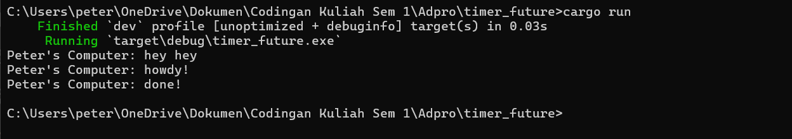
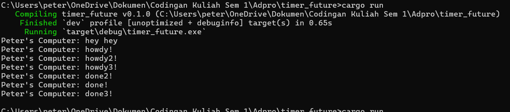
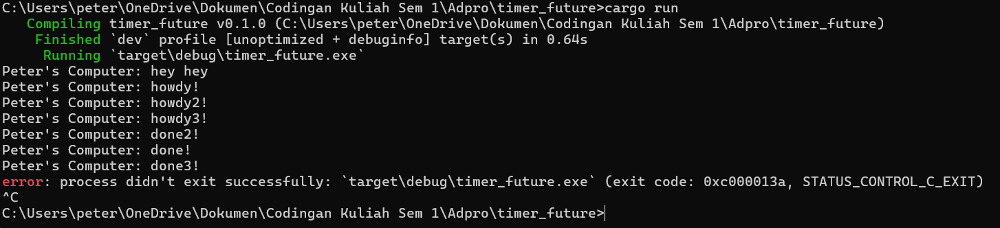

# Reflection

### commit 1.2

- karena spawner(print howdy dan done) baru akan di execute setelah print hey hey dijalankan.

### commit 1.3
#### tanpa drop

#### dengan drop

- Karena kita mengespawn task sebanyak 3x maka saat kita execute, executor akan menjalankan 3 task itu secara bersamaan. Ini menjelaskan kenapa saat saya menjalankan programnya beberapa kali, kadang ada urutan print yang tidak beraturan (terjadi race condition). Spawner untuk membuat task, executor untuk mengerjakan task, dan drop untuk menghentikan executor untuk listen ke channel. Maka dari itu kenapa saat kita menghilangkan drop, program akan berjalan terus tanpa berhenti karena menunggu ada task baru lagi sementara saat drop dimasukkan, program akan segera berhenti ketika selesai mengeprint.